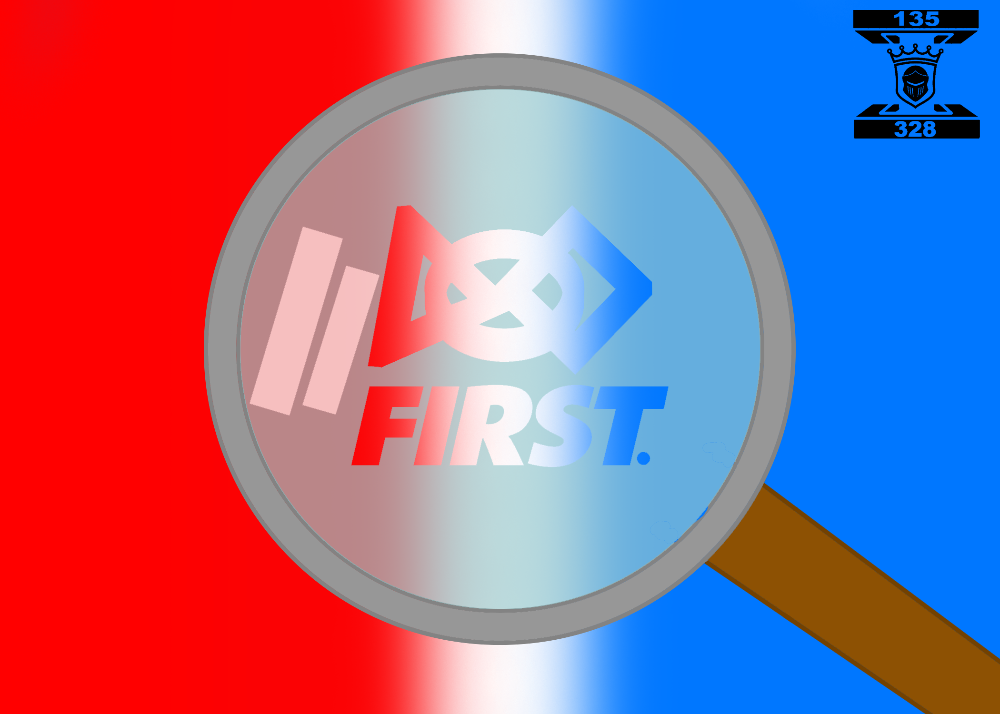

Hello, and welcome to the Scouting App 2026 prototype!

We created this website to support newer FRC teams in Indiana. Being a new FRC team can be challenging due to limited materials and time. We wanted to help by developing a web-based scouting app that teams can quickly start using and easily modify to fit their needs.

This is a PWA, which stands for Progressive Web Application.
How a PWA works is that when you first enter the website it will cache all the necessary files into your storage and that the website will act like an application.

Tech stack: Html , CSS , js   basic website requirements

The reason why we chose to make a website and not an app is because websites are easier to learn and faster to code.

How do we collect the data?

after filling out information on the previous screens both Subjective and play-off you will be able to access robot data and you will be given a qr code that will give you all the information you need but
do not search it up instead view the preview information copy it and paste it in a doc like notes app

How can this help?

This website is the skeleton of the final version you will make. Everything with design and logic is already done for you. It saves time from starting from scratch and can boost productivity. With more time in your hands using this prototype. You can implement more complex features to your Scouting strategy.

This prototype allows you to be able to focus more on the robot than scouting. You just need to finish the prototype and add features necessary for your needs.

Things you need to do:

    1.make interactive map of the seasons game(objective).
    2.improve on how you can collect data we only gave you a simple qr code.
    3.Change the design on how you think it would look better.
    4.Finish the PWA, We gave you the code to get started.

Project Logo:

