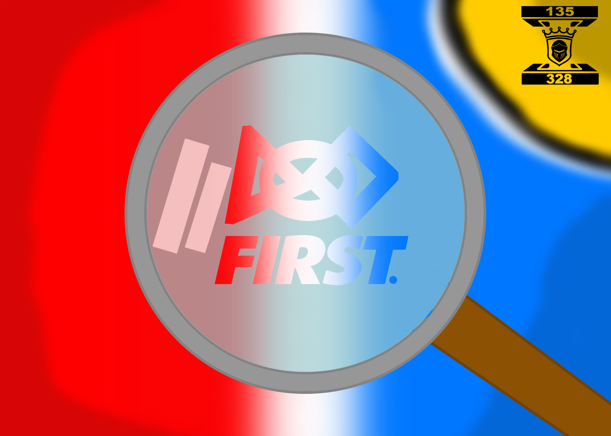

# Penn Robotics 2026 Open Alliance Scouting App Prototype
Hello, and welcome to the Scouting App 2026 prototype!

We created this website to support newer FRC teams in Indiana. Being a new FRC team can be challenging due to limited materials and time, and we wanted to help by developing a web-based scouting app that teams can quickly start using and easily modify to fit their needs.

This is a PWA, which stands for Progressive Web Application.
A PWA requires an internet connection at first, but after, caches all the data to run offline.

While we would love to make this an app, there are no easy ways to turn this HTML5 based site into an app while allowing mobile support.

---
## How do we collect the data?
After the scouter fills out both the `Objective` & `Subjective` screen, `Robot Data` will be accessible, which gives you 2 QR Codes, top one being `Subjective` and the bottom one being `Objective`.
The data inside of the QR Codes are `JSON`.
> [What is JSON?](https://www.w3schools.com/whatis/whatis_json.asp) 

## How can this help?
This website is the skeleton of the final version you will make. Everything with design and logic is already done for you. It saves time from starting from scratch and can boost productivity. With more time in your hands using this prototype, you can implement complex features to your Scouting strategy.

This prototype allows you to be able to focus more on the robot than scouting. You just need to finish the prototype and add features necessary for your needs.

Things you need to do:
1. Make an interactive map of the seasons game (Objective Screen).
2. Improve on how you can collect data, we only gave you a simple qr code.
3. Change the design on how you think it would look better.
4. Finish the PWA, We gave you the code to get started.
5. Give the website a domain. ([Github Sites](https://docs.github.com/en/pages) are free!).
---
If you're new to Web development, then there are several different resources.
1. [W3Schools](https://www.w3schools.com/)
2. [Mozilla Developers](https://developer.mozilla.org/en-US/docs/Learn_web_development)

In short, there are 3 different types of files within this project that relate to the app.
1. `.js` files, those are the `JavaScript` files which holds all the programming logic, such as QR Code generation and menu traversal
> [What is JavaScript?](https://www.w3schools.com/whatis/whatis_js.asp) 
3. `.css` files, those are the `Cascading-Style-Sheet` files, CSS, which hold all the style data, such as the background image and button layout
> [What is CSS?](https://www.w3schools.com/whatis/whatis_css.asp) 
4. `.html` file, this is the site itself, without this, `JS` and `CSS` do nothing, this contains the bare minimum such as buttons and pages
> [What is HTML?](https://www.w3schools.com/whatis/whatis_html.asp) 

Project Logo:

